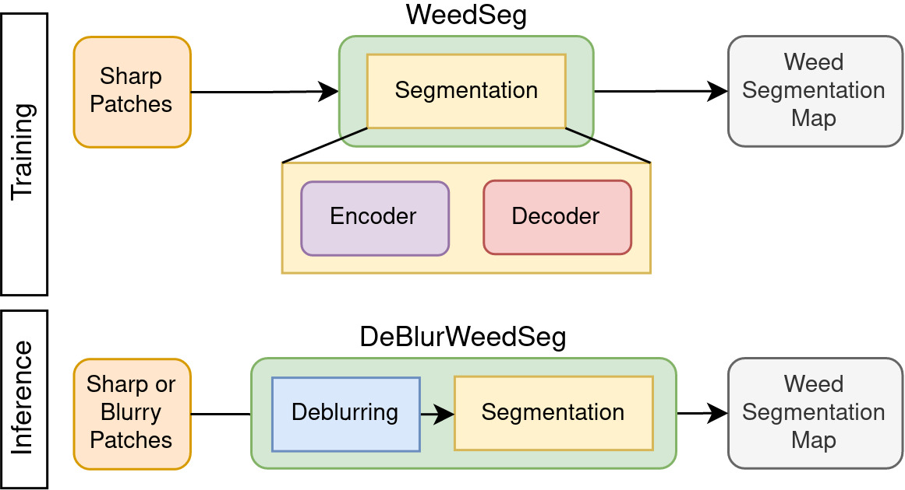
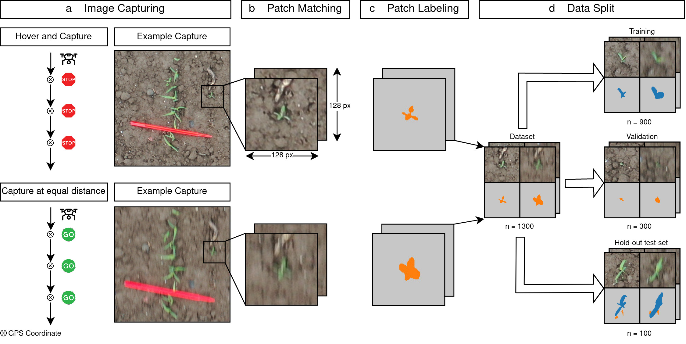
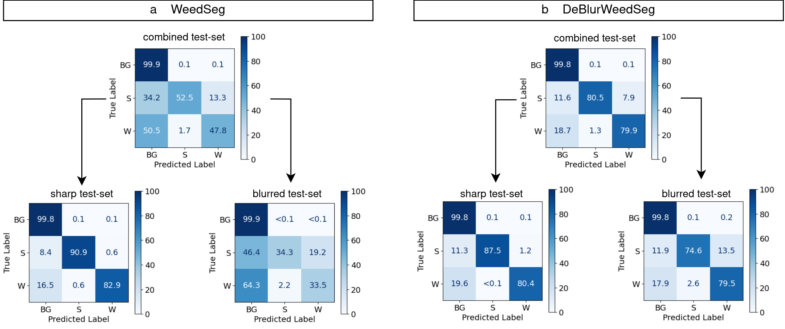
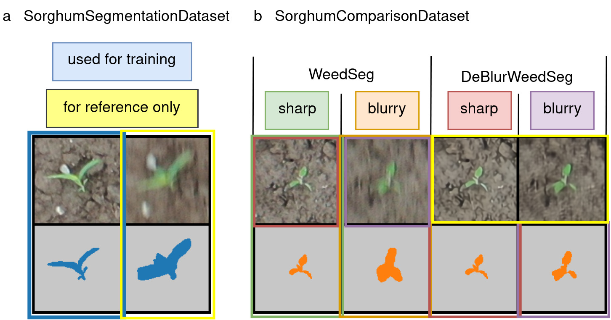

# DeBlurWeedSeg

[](https://www.python.org/downloads/release/python-388/)
[](https://github.com/pytorch/pytorch/releases/tag/v1.10.0)
[](https://opensource.org/licenses/MIT)

This repository provides the source code for "Improved Weed Segmentation in UAV Imagery of Sorghum Fields with a Combined Deblurring Segmentation Model".
In this study, we present a novel deep-learning based model for weed segmentation in UAV images called `DeBlurWeedSeg`. This model is a combination of a deblurring and segmentation model (see Figure 1b bottom). Our experiments show that a typical weed segmentation model (Figure b top) cannot segment weeds from crop and background in motion blurred images at test time and our model is able to deal with sharp and motion blurred images without fine-tuning.
<p align="center">
    
</p>

**Figure 1**: Comparison Partners used for this study. Please refer to the method section in the paper for a detailed description.


<p align="center">
    
</p>

**Figure 2**: Experimental Setup used in this study. Please refer to the method section in the paper for a detailed description.


## Results on the hold-out test-set
Results of WeedSeg compared to DeBlurWeedSeg.

|                Model | Sorensen-Dice-Coefficient | 
|---------------------:|--------------------------:|
| WeedSeg (scenario 1) |                    0.7327 |
| WeedSeg (scenario 2) |                    0.7381 |
|        DeBlurWeedSeg |                    0.8373 |

The confusion matrix shows per-class accuracies for Background (BG), Sorghum (S) and Weed (W). Here we can clearly see a drop in performance for weed and sorghum in motion blurred image patches. Our proposed model is able to perform similarly well on sharp and deblurred image patches.
<p align="center">
    
</p>

**Figure 3**: Pixel-based classification results shown in a normalised confusion matrix in percent. 


## Reproduce Results
1. Clone this repository.
2. Download the data and the model from mendeley data using the link https://data.mendeley.com/datasets/k4gvsjv4t3/1.
3. Extract and move the content of the data folder in `data`. Move the model called `model.h5` into `models`.
4. Install the DeBlurring Model NAFNet (see next Section)
5. Generate the results on the hold-out test-set
```bash
python3 generate_results.py
```
This script will generate the quantitative results shown in the results section of our paper. 
6. Generate results of the deblurring model
```bash
python3 evaluate_deblurring.py
```

## Install the deblurring model NAFNet
First, clone the NAFNet package from https://github.com/megvii-research/NAFNet and follow the installation steps
Additionally, we install the package `cog`:
```bash
pip install cog
```
Then download the weights of "NAFNet-REDS-width64.pth" into `.NAFNet/experiments/pretrained_models/`
This can be done from `https://github.com/megvii-research/NAFNet/#results-and-pre-trained-models`

## Explanation of the data structure
We made our dataset publicly available on Mendeley data in the file `data.zip`. 
After extracting this file, there will be 3 subfolders. 
- `gt`: 1300 matching sharp and blurry image-pairs and their semantic segmentation masks. This folder contains the whole dataset. One example image is shown in Figure 4a, where only the sharp patches are used for training. The blurry counter-part is saved for reference only.
- `gt_testset` 100 patches of the hold-out test-set that were used to evaluate the main findings of our research. The structure is similar to the patches in the `gt` folder, but with additional deblurred versions and their corresponding semantic segmentations. For the sharp image patches that were deblurred, we used the same semantic masks as for the sharp patches, as there was little difference after the deblurring step. After deblurring the blurry patches, the image content changed to a large extent, therefore we needed to re-label these patches for a fair comparison. In the files, we show the deblurred images only for reference reasons, as they are generated by the `DeBlurWeedSeg` model internally.  
- `splits`: 3 csv files for the dataset split. Used for training, validating and testing our models.

<p align="center">
    
</p>

**Figure 4**: Explanation of our dataset structure. **a** Dataset used for training the model with the class SorghumSegmentationDataset. **b** Hold-out test-set used for comparing our main results of the research using the class SorghumComparisonDataset.

## Reproduce the hyperparameter optimisation results
1. Data Split
```bash
python3 split_data.py
```
This script will ensure a stratified split based on the number and type of plants present in a patch.

2. Hyperparameter Optimisation
Change the encoder name and possible batch sizes in the following script accordingly. CSV files with metrics of the run will be saved in the `logs` directory.
```bash
python3 hyperparameter_optimisation.py
```
We provide a summary of the hyperparameter optimisation trials from this study in `results/all_hp_results.csv`.

3. Re-train on the full training + validation split and save the final model for predictions.
```bash
python3 retrain.py --encoder_name resnet50 --max_steps 2960 --batch_size 128 --learning_rate 0.0005395030966670228
```
The values correspond to the best hyperparameter set of our study.


# Publication and Citation
Improved weed segmentation in UAV imagery of sorghum fields with a combined deblurring segmentation model
Genze, N., Wirth, M., Schreiner, C., Ajekwe, R., Grieb, M., & Grimm, D. G.
Plant Methods, 2023, https://doi.org/10.1186/s13007-023-01060-8

@article{genze_improved_2023,
	title = {Improved weed segmentation in {UAV} imagery of sorghum fields with a combined deblurring segmentation model},
	volume = {19},
	issn = {1746-4811},
	url = {https://doi.org/10.1186/s13007-023-01060-8},
	doi = {10.1186/s13007-023-01060-8},
	number = {1},
	journal = {Plant Methods},
	author = {Genze, Nikita and Wirth, Maximilian and Schreiner, Christian and Ajekwe, Raymond and Grieb, Michael and Grimm, Dominik G.},
	month = aug,
	year = {2023},
	pages = {87},
}
